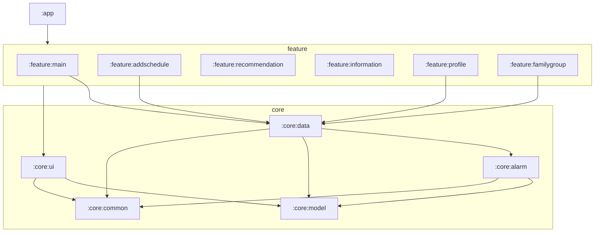

# 아키텍처

## 모듈 구조 (11개)

`:app` + `:core`(5) + `:feature`(6)

| 모듈 | 내용 |
|---|---|
| `:app` | MainActivity · Application · AppNavigation · auth · debug |
| `:feature:main` | main · done · timeline · settings (MainViewModel 공유) |
| `:feature:addschedule` | 일정 추가/편집 |
| `:feature:recommendation` / `:information` / `:profile` / `:familygroup` | 각 화면 |
| `:core:ui` | 테마 · 공용 컴포넌트(Compose api 노출) |
| `:core:data` | Repository · FirestoreDB · VertexAI (Hilt) |
| `:core:alarm` | notification · receiver · 알람 UI · FCM |
| `:core:model` | 엔티티(Schedule · User · …) |
| `:core:common` | util · constants |

## 의존 규칙
- `:app` → feature → core **(단방향 DAG, 순환 없음)**
- `:core:data` → `:core:alarm` : Repository가 `GuardianNotifier`(FCM)를 호출 → 추후 인터페이스로 역결합 제거 예정(#28)
- 모든 core → `:core:model` / `:core:common`
- (과거 `util ↔ data` 순환은 `:core:common` 추출로 해소)

## DI (Hilt)
- `@HiltAndroidApp` (Application) · `@AndroidEntryPoint` (MainActivity)
- `@HiltViewModel` + `@Inject constructor` (전 ViewModel) · Repository `@Inject constructor`
- 화면은 `hiltViewModel()`로 주입
- ⚠ JavaPoet 충돌은 root `build.gradle.kts`에서 `javapoet:1.13.0` 강제로 해결

## 레이어 (Google 앱 아키텍처)
UI(Compose) → Domain(선택) → Data. **Repository가 데이터 레이어 유일 진입점.**
