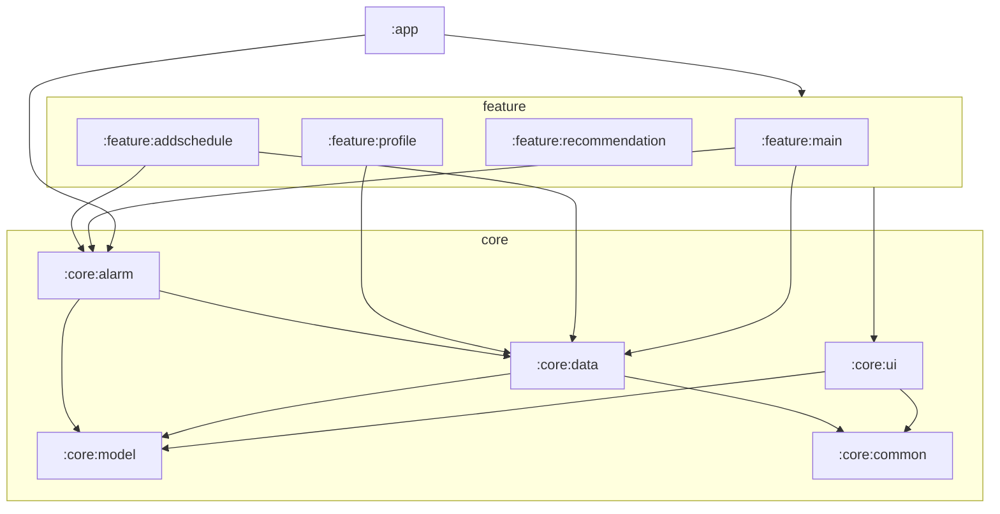

# 아키텍처

## 모듈 구조 (10개)

`:app` + `:core`(5) + `:feature`(4)

```mermaid
graph TD
  app[":app"]
  subgraph feature
    fmain[":feature:main"]
    fadd[":feature:addschedule"]
    frec[":feature:recommendation"]
    fprof[":feature:profile"]
  end
  subgraph core
    cui[":core:ui"]
    cdata[":core:data"]
    calarm[":core:alarm"]
    cmodel[":core:model"]
    ccommon[":core:common"]
  end
  app --> feature
  app --> calarm
  feature --> cui
  fmain --> cdata
  fadd --> cdata
  fprof --> cdata
  fmain --> calarm
  fadd --> calarm
  calarm --> cdata
  cui --> cmodel
  cdata --> cmodel
  calarm --> cmodel
  cui --> ccommon
  cdata --> ccommon
```

| 모듈 | 내용 |
|---|---|
| `:app` | Application · MainActivity · AppNavigation · auth |
| `:feature:main` | main · done · timeline · settings (화면마다 별도 ViewModel) |
| `:feature:addschedule` | 일정 추가/수정 |
| `:feature:recommendation` | 유형별 추천 일정 |
| `:feature:profile` | 프로필 · 계정 삭제 |
| `:core:ui` | 테마 토큰 · 공용 컴포넌트 · MVI 베이스(Compose 를 api 로 노출) |
| `:core:data` | Repository · Firestore 컬렉션 상수 · Hilt Firebase 모듈 |
| `:core:alarm` | AlarmScheduler · 알림 · 알람 전체화면 · FCM |
| `:core:model` | 엔티티(Schedule · User · …) |
| `:core:common` | util · constants · 오류 매핑 |

## 의존 규칙
- `:app` → feature → core (단방향 DAG, 순환 없음)
- `:core:data` 는 `Notifier` 인터페이스만 두고 구현(`GuardianNotifier`)은 `:core:alarm` 이 Hilt 로 바인딩한다. 종전의 data → alarm 역결합은 이렇게 끊었다(#28, #58).
- 모든 core → `:core:model` / `:core:common`

## 빌드 설정
- 모듈 공통 설정(SDK·JVM·Compose·Hilt 배선)은 `build-logic` 컨벤션 플러그인 다섯 개에 있다(#25). 모듈 빌드 파일에는 네임스페이스와 모듈 고유 의존만 둔다.
- SDK·툴체인 숫자의 정본은 `build-logic/convention/.../KotlinAndroid.kt` 와 `gradle/libs.versions.toml` 이다.

## DI (Hilt)
- `@HiltAndroidApp`(Application) · `@AndroidEntryPoint`(MainActivity)
- `@HiltViewModel` + `@Inject constructor`(전 ViewModel) · Repository `@Inject constructor`
- Firebase 진입점(FirebaseAuth·FirebaseFirestore·FirebaseMessaging)은 `FirebaseModule` 이 제공한다. `getInstance()` 를 화면·저장소에서 직접 부르지 않는다.
- JavaPoet 충돌은 루트 `build.gradle.kts` 에서 `javapoet:1.13.0` 강제로 해결한다.

## 레이어 (Google 앱 아키텍처)
UI(Compose) → Domain(선택) → Data. Repository 가 데이터 레이어 유일 진입점이다. 프레젠테이션은 MVI 로 쓰며 계약은 [docs/architecture.md](../docs/architecture.md) 에 있다.
